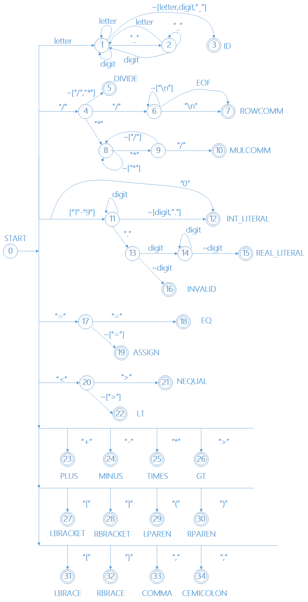

A CMM (C Minus Minus) Parser Written in Python

附录1：CMM词法对应表

|Token|lexeme|
|--------|--------|
|IF|"if"|
|ELSE|"else"|
|WHILE|"while"|
|READ|"read"|
|WRITE|"write"|
|INT|"int"|
|REAL|"real"|
|BOOL|"bool"|
|TRUE|"true"|
|FALSE|"false"|
|PLUS|"+"|
|MINUS|"-"|
|TIMES|"*"|
|DIVIDE|"/"|
|ASSIGN|"="|
|LT|"<"|
|GT|">"|
|EQUAL|"=="|
|NEQUAL|"<>"|
|LPAREN|"("|
|RPAREN|")"|
|LBRACE|"{"|
|RBRACE|"}"|
|LBRACKET|"["|
|RBRACKET|"]"|
|ROWCOMM|"//"|
|LEFTCOMM|"/*"|
|RIGHTCOMM|"*/"|
|COMMA|","|
|SEMICOLON|";"|
|LETTER|["a"-"z"]&#124;["A"-"Z"]
|DIGIT|["0"-"9"]
|ID|&lt;LETTER&gt;&#124;((&lt;LETTER&gt; &#124; &lt;DIGIT&gt; &#124; "_") * ( &lt;LETTER&gt; &#124; &lt;DIGIT&gt; ))?
|INT_LITERAL|["1"-"9"] (&lt;DIGIT&gt;)* &#124; "0"
|REAL_LITERAL|&lt;INT_LITERAL&gt;("."(&lt;INT_LITERAL&gt;)+)?

附录2：CMM词法DFA

